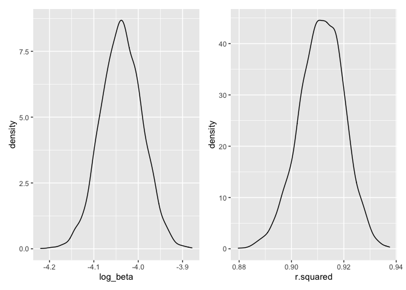

Yujin Zhang

``` r
library(tidyverse)
```

    ## ── Attaching packages ─────────────────────────────────────── tidyverse 1.3.1 ──

    ## ✓ ggplot2 3.3.5     ✓ purrr   0.3.4
    ## ✓ tibble  3.1.6     ✓ dplyr   1.0.7
    ## ✓ tidyr   1.1.4     ✓ stringr 1.4.0
    ## ✓ readr   2.1.0     ✓ forcats 0.5.1

    ## ── Conflicts ────────────────────────────────────────── tidyverse_conflicts() ──
    ## x dplyr::filter() masks stats::filter()
    ## x dplyr::lag()    masks stats::lag()

``` r
library(modelr)
library(mgcv)
```

    ## Loading required package: nlme

    ## 
    ## Attaching package: 'nlme'

    ## The following object is masked from 'package:dplyr':
    ## 
    ##     collapse

    ## This is mgcv 1.8-36. For overview type 'help("mgcv-package")'.

``` r
library(patchwork)

set.seed(5)

options(
  ggplot2.continuous.colour = "viridis",
  ggplot2.continuous.fill = "viridis"
)
```

## Problem 1

Load the data set and clean the data.

``` r
bw_df = 
  read_csv("birthweight.csv") %>% 
  # convert numeric to factor
  mutate(
    babysex = as.factor(babysex),
    frace = as.factor(frace),
    mrace = as.factor(mrace)
  ) %>% 
  drop_na() %>% 
  select(bwt, everything())
```

    ## Rows: 4342 Columns: 20

    ## ── Column specification ────────────────────────────────────────────────────────
    ## Delimiter: ","
    ## dbl (20): babysex, bhead, blength, bwt, delwt, fincome, frace, gaweeks, malf...

    ## 
    ## ℹ Use `spec()` to retrieve the full column specification for this data.
    ## ℹ Specify the column types or set `show_col_types = FALSE` to quiet this message.

First, propose a regression model for birthweight. This model may be
based on a hypothesized structure for the factors that underly
birthweight, on a data-driven model-building process, or a combination
of the two.

Here is the modeling process:

1.  Determine if each variable has a linear relationship with birth
    weight.

``` r
# Let's first do the linear regression for individual variables.
babysex_fit = lm(bwt ~ babysex, data = bw_df) %>% 
  broom::tidy()
bhead_fit = lm(bwt ~ bhead, data = bw_df) %>% 
  broom::tidy()
blength_fit = lm(bwt ~ blength, data = bw_df) %>% 
  broom::tidy()
delwt_fit = lm(bwt ~ delwt, data = bw_df) %>% 
  broom::tidy()
fincome_fit = lm(bwt ~ fincome, data = bw_df) %>% 
  broom::tidy()
frace_fit = lm(bwt ~ frace, data = bw_df) %>% 
  broom::tidy()
gaweeks_fit = lm(bwt ~ gaweeks, data = bw_df) %>% 
  broom::tidy()
malform_fit = lm(bwt ~ malform, data = bw_df) %>% 
  broom::tidy()
menarche_fit = lm(bwt ~ menarche, data = bw_df) %>% 
  broom::tidy()
mheight_fit = lm(bwt ~ mheight, data = bw_df) %>% 
  broom::tidy()
momage_fit = lm(bwt ~ momage, data = bw_df) %>% 
  broom::tidy()
mrace_fit = lm(bwt ~ mrace, data = bw_df) %>% 
  broom::tidy()
parity_fit = lm(bwt ~ parity, data = bw_df) %>% 
  broom::tidy()
pnumlbw_fit = lm(bwt ~ pnumlbw, data = bw_df) %>% 
  broom::tidy()
pnumsga_fit = lm(bwt ~ pnumsga, data = bw_df) %>% 
  broom::tidy()
ppbmi_fit = lm(bwt ~ ppbmi, data = bw_df) %>% 
  broom::tidy()
ppwt_fit = lm(bwt ~ ppwt, data = bw_df) %>% 
  broom::tidy()
smoken_fit = lm(bwt ~ smoken, data = bw_df) %>% 
  broom::tidy()
wtgain_fit = lm(bwt ~ wtgain, data = bw_df) %>% 
  broom::tidy()

marginal_df = 
  rbind(babysex_fit, bhead_fit, blength_fit, delwt_fit, fincome_fit, frace_fit, gaweeks_fit,
        malform_fit, menarche_fit, mheight_fit, momage_fit, mrace_fit, parity_fit, pnumlbw_fit,
        pnumsga_fit, ppbmi_fit, ppwt_fit, smoken_fit, wtgain_fit) %>% 
  drop_na()
```

Then we get that variables `babysex`, `bhead`, `blength`, `delwt`,
`fincome`, `gaweeks`, `mheight`, `momage`, `ppwt`, `smoken` and `wtgain`
have significant linear association with birth weight.

2.  Check the independence of observations

``` r
cor(bw_df$bhead, bw_df$delwt)
```

    ## [1] 0.2143707

``` r
cor(bw_df$blength, bw_df$delwt)
```

    ## [1] 0.2291494

``` r
cor(bw_df$delwt, bw_df$gaweeks)
```

    ## [1] 0.1242785

``` r
cor(bw_df$delwt, bw_df$gaweeks)
```

    ## [1] 0.1242785

``` r
cor(bw_df$fincome, bw_df$delwt)
```

    ## [1] 0.03499435

``` r
cor(bw_df$delwt, bw_df$gaweeks)
```

    ## [1] 0.1242785

``` r
cor(bw_df$delwt, bw_df$mheight)
```

    ## [1] 0.4112576

``` r
cor(bw_df$delwt, bw_df$momage)
```

    ## [1] 0.07404092

``` r
cor(bw_df$delwt, bw_df$ppwt)
```

    ## [1] 0.8709133

``` r
cor(bw_df$delwt, bw_df$smoken)
```

    ## [1] 0.04861273

``` r
cor(bw_df$delwt, bw_df$wtgain)
```

    ## [1] 0.4247883

``` r
# So we can find high correlation between delwt and ppwt, delwt and mheight, delwt and wtgain

cor(bw_df$fincome, bw_df$gaweeks)
```

    ## [1] 0.1066777

``` r
cor(bw_df$fincome, bw_df$mheight)
```

    ## [1] 0.1310186

``` r
cor(bw_df$fincome, bw_df$momage)
```

    ## [1] 0.3231142

``` r
cor(bw_df$fincome, bw_df$ppwt)
```

    ## [1] 0.04725264

``` r
cor(bw_df$fincome, bw_df$smoken)
```

    ## [1] 0.07794305

``` r
cor(bw_df$fincome, bw_df$wtgain)
```

    ## [1] -0.01603771

``` r
# So we can find high correlation between fincome and momage

cor(bw_df$gaweeks, bw_df$mheight)
```

    ## [1] 0.06213774

``` r
cor(bw_df$gaweeks, bw_df$momage)
```

    ## [1] 0.1139098

``` r
cor(bw_df$gaweeks, bw_df$ppwt)
```

    ## [1] 0.05647304

``` r
cor(bw_df$gaweeks, bw_df$smoken)
```

    ## [1] 0.03621168

``` r
cor(bw_df$gaweeks, bw_df$wtgain)
```

    ## [1] 0.148146

``` r
# No significant correlation is observed

cor(bw_df$mheight, bw_df$momage)
```

    ## [1] 0.109048

``` r
cor(bw_df$mheight, bw_df$ppwt)
```

    ## [1] 0.4266872

``` r
cor(bw_df$mheight, bw_df$smoken)
```

    ## [1] 0.06098352

``` r
cor(bw_df$mheight, bw_df$wtgain)
```

    ## [1] 0.04847893

``` r
# So we can find high correlation between mheight and ppwt

cor(bw_df$momage, bw_df$ppwt)
```

    ## [1] 0.1295921

``` r
cor(bw_df$momage, bw_df$smoken)
```

    ## [1] 0.07545435

``` r
cor(bw_df$momage, bw_df$wtgain)
```

    ## [1] -0.0884876

``` r
cor(bw_df$ppwt, bw_df$smoken)
```

    ## [1] 0.03885475

``` r
cor(bw_df$ppwt, bw_df$wtgain)
```

    ## [1] -0.07494032

``` r
cor(bw_df$smoken, bw_df$wtgain)
```

    ## [1] 0.02706577

``` r
# No significant correlation is observed
```

Hence, we try to use babysex, bhead, blength, delwt and ppwt and
mheight, delwt and wtgain, fincome and momage as predictors.

Let’s propose a regression model for birthweight with these variables.

``` r
lm_fit = lm(bwt ~ babysex + bhead + blength + delwt * ppwt * mheight + fincome * momage + delwt * wtgain, data = bw_df)

lm_fit %>% 
  broom::tidy() %>% 
  select(term, estimate, p.value) %>% 
  knitr::kable(digits = 4)
```

| term               |   estimate | p.value |
|:-------------------|-----------:|--------:|
| (Intercept)        | -4440.3034 |  0.0352 |
| babysex2           |    39.9397 |  0.0000 |
| bhead              |   140.4531 |  0.0000 |
| blength            |    80.6439 |  0.0000 |
| delwt              |   -28.5513 |  0.0751 |
| ppwt               |    13.7627 |  0.4900 |
| mheight            |   -28.4448 |  0.3858 |
| fincome            |    -0.1744 |  0.8486 |
| momage             |     1.9394 |  0.4112 |
| wtgain             |         NA |      NA |
| delwt:ppwt         |     0.0448 |  0.6665 |
| delwt:mheight      |     0.6104 |  0.0177 |
| ppwt:mheight       |    -0.3086 |  0.3241 |
| fincome:momage     |     0.0585 |  0.1727 |
| delwt:wtgain       |    -0.0269 |  0.0396 |
| delwt:ppwt:mheight |    -0.0008 |  0.5958 |

Then do the regression diagnostic. And show a plot of model residuals
against fitted values – use add\_predictions and add\_residuals in
making this plot.

``` r
bw_df %>% 
  modelr::add_residuals(lm_fit) %>% 
  modelr::add_predictions(lm_fit) %>%
  ggplot(aes(x = pred, y = resid)) +
  geom_point() +
  geom_smooth(method = "lm", se = FALSE)
```

    ## Warning in predict.lm(model, data): prediction from a rank-deficient fit may be
    ## misleading

    ## Warning in predict.lm(model, data): prediction from a rank-deficient fit may be
    ## misleading

    ## `geom_smooth()` using formula 'y ~ x'

<!-- -->

According to the above graph, we can observe that the residuals are
almost uniformly distributed around 0, but there are some outliers whose
residuals are bigger that 2000.

Next, compare my model to two others in the homework problem:

``` r
# One using length at birth and gestational age as predictors (main effects only)
fit_1 =
  lm(bwt ~ blength + gaweeks, data = bw_df)

# One using head circumference, length, sex, and all interactions (including the three-way interaction) between these
fit_2 = 
  lm(bwt ~ bhead + blength + babysex + bhead * blength * babysex, data = bw_df)
```

Let’s make this comparison in terms of the cross-validated prediction
error

``` r
cv_df = 
  crossv_mc(bw_df, 100)

# set train and test table
cv_df =
  cv_df %>% 
  mutate(
    train = map(train, as_tibble),
    test = map(test, as_tibble))
```

``` r
cv_df = 
  cv_df %>% 
  mutate(
    mod_1  = map(train, ~lm_fit),
    mod_2  = map(train, ~fit_1),
    mod_3  = map(train, ~fit_2)) %>% 
  mutate(
    rmse_linear_1 = map2_dbl(mod_1, test, ~rmse(model = .x, data = .y)),
    rmse_linear_2 = map2_dbl(mod_2, test, ~rmse(model = .x, data = .y)),
    rmse_linear_3 = map2_dbl(mod_3, test, ~rmse(model = .x, data = .y)))
```

``` r
# make a plot to see the results
cv_df %>% 
  select(starts_with("rmse")) %>% 
  pivot_longer(
    everything(),
    names_to = "model", 
    values_to = "rmse",
    names_prefix = "rmse_") %>% 
  mutate(model = fct_inorder(model)) %>% 
  ggplot(aes(x = model, y = rmse)) + geom_violin()
```

<!-- -->

Based on these results, there’s clearly some improvement in predictive
accuracy gained by my own regression model.

## Problem 2

Load data set.

``` r
weather_df = 
  rnoaa::meteo_pull_monitors(
    c("USW00094728"),
    var = c("PRCP", "TMIN", "TMAX"), 
    date_min = "2017-01-01",
    date_max = "2017-12-31") %>%
  mutate(
    name = recode(id, USW00094728 = "CentralPark_NY"),
    tmin = tmin / 10,
    tmax = tmax / 10) %>%
  select(name, id, everything())
```

    ## Registered S3 method overwritten by 'hoardr':
    ##   method           from
    ##   print.cache_info httr

    ## using cached file: ~/Library/Caches/R/noaa_ghcnd/USW00094728.dly

    ## date created (size, mb): 2021-10-05 10:31:20 (7.602)

    ## file min/max dates: 1869-01-01 / 2021-10-31

We’ll focus on a simple linear regression with “tmax” as the response
and “tmin” as the predictor, and are interested in the distribution of
two quantities estimated from these data:

*r̃*<sup>2</sup> and *l**o**g*(*β̃*<sub>0</sub> \* *β̃*<sub>1</sub>)

Then, use 5000 bootstrap samples and, for each bootstrap sample, produce
estimates of these two quantities. Plot the distribution of your
estimates.

``` r
result_bootstrap =
  weather_df %>% 
  bootstrap(n = 5000, id = "strap_number") %>% 
  mutate(
    models = map(.x = strap, ~lm(tmax ~ tmin, data = .x)),
    results = map(models, broom::tidy),
    r.squared = map(models, broom::glance)
  ) %>% 
  select(results, r.squared) %>% 
  unnest(r.squared) %>%
  select(results, r.squared) %>% 
  unnest(results) %>% 
  mutate("log_beta" = log(estimate * std.error)
  ) %>% 
  filter(term == "tmin")
```

Next, making plots to show the distributions of my estimates.

``` r
# distribution of log_beta
plot_1 =
  result_bootstrap %>%   
  ggplot(aes(x = log_beta)) + geom_density()

# distribution of r squared
plot_2 = 
  result_bootstrap %>%   
  ggplot(aes(x = r.squared)) + geom_density()

# make a combined plot
plot_1 + plot_2
```

<!-- -->

Describe: as the plot shows above, we can conclude that with the 5000
sample size, the estimate variables are tend to be normally distributed.

Finally, let’s use the 5000 bootstrap estimates, identify the 2.5% and
97.5% quantile to provide a 95% confidence interval for two estimate
variables.

``` r
# identify the quantiles

ci = tibble(
  estimate = c("r.squared", "log_beta"),
   quantile_2.5 = c(quantile(result_bootstrap$r.squared, probs = 0.025),
             quantile(result_bootstrap$log_beta, probs = 0.025)),
   quantile_97.5 = c(quantile(result_bootstrap$r.squared, probs = 0.975),
              quantile(result_bootstrap$log_beta, probs = 0.975))
   ) %>% 
  mutate(interval = quantile_97.5 - quantile_2.5,
         quantile_2.5 = as.numeric(quantile_2.5),
         quantile_97.5 = as.numeric(quantile_97.5)
         )

ci
```

    ## # A tibble: 2 × 4
    ##   estimate  quantile_2.5 quantile_97.5 interval
    ##   <chr>            <dbl>         <dbl>    <dbl>
    ## 1 r.squared        0.894         0.927   0.0338
    ## 2 log_beta        -4.13         -3.95    0.182

The 95% confidence interval of *r̃*<sup>2</sup> is (0.8936836,
0.9274641).

The 95% confidence interval of
*l**o**g*(*β̃*<sub>0</sub> \* *β̃*<sub>1</sub>) is (-4.1288336,
-3.9468567).
